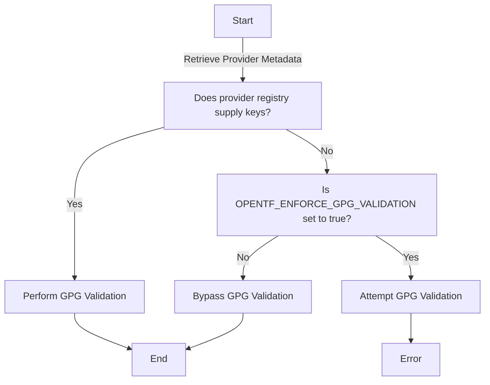

# Provider GPG Key Handling in OpenTF Registry: Temporary Non-Failure Response to Missing Public Keys

Issue: https://github.com/opentofu/opentofu/issues/266

> [!NOTE]  
> This RFC was originally written by @Yantrio and was ported from the old RFC process. It should not be used as a reference for current RFC best practices.

This RFC attempts to temporarily solve the issue where provider keys are not known by provider registries, causing OpenTF to fail provider validation.

To allow users to carry on working with OpenTF, we set out to provide a process in which the end users of OpenTF can work around this temporary issue until a solution for providing keys in the registry is completed.

With the launch of OpenTF, we've recognized the necessity to introduce a new registry for the associated provider ecosystem. This fresh registry, designed to specifically cater to OpenTF, faces a foundational challenge: we currently do not possess copies of all the GPG keys that provider authors utilize to sign their packages.

## Proposed Solution

### User Documentation

By introducing a new environment variable `OPENTF_ENFORCE_GPG_VALIDATION`, end users can control the functionality of GPG validation.

This environment variable only takes effect if the provider metadata downloaded from the registry does not provide any keys for validation. If the provider registry supplies keys, then validation will still occur.

- When set to `false`, this environment variable acts to bypass the GPG validation checks. (default)
- When set to `true`, this environment variable acts to enforce the GPG validation checks.

### Technical Approach

By introducing a new temporary flow to the current Package authentication process, we can control if validation occurs or not.

See the original code here: https://github.com/opentffoundation/opentf/blob/b36ff25ea7b922b0a7efd883ebeee9275b56945f/internal/getproviders/package_authentication.go#L370-L380

If the provider registry has supplied a list of keys for the provider version download, we will always validate those.

If the provider registry has not supplied any keys, we check if the environment variable is set to `true` (enforcing), and if so we will attempt to validate any keys we can (most likely resulting in an error). Otherwise if the variable is `false` (default) we will ignore validation for those providers and allow them to be used.

Proof of concept: https://github.com/opentofu/opentofu/pull/309

#### Flow Diagram

### Open Questions

* How do we / can we fully hydrate the providers in the registry?
* Do we want to set a deadline of a timeframe or even a release version to make sure that this feature is removed?

### Future Considerations

## Potential Alternatives
