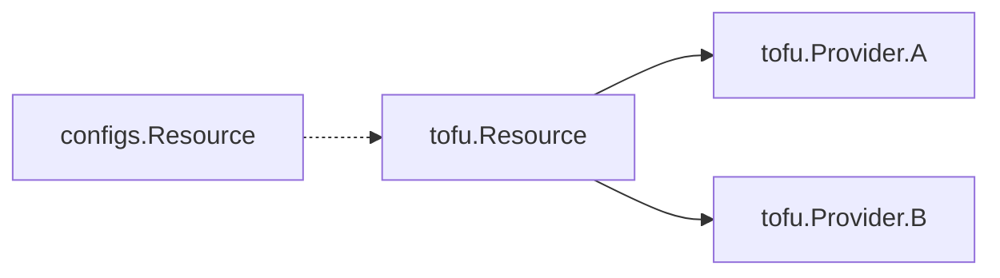
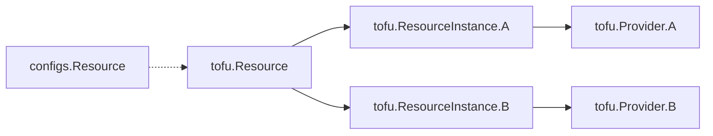

# Static Evaluation of Provider Iteration

Issue: https://github.com/opentofu/opentofu/issues/300

Since the introduction of for_each/count, users have been trying to use each/count in provider configurations and resource/module mappings. Providers are a special case throughout OpenTofu and interacting with them either as a user or developer requires significant care.

> [!Note]
> Please read [Provider References](../docs/provider-references.md) before diving into this section! This document uses the same terminology and formatting.

## Proposed Solution

The approach proposed in the [Static Evaluation RFC](20240513-static-evaluation.md) can be extended to support provider for_each/count with some clever code and lots of testing. It is assumed that the reader has gone through the Static Evaluation RFC thoroughly before continuing here.

### User Documentation

#### Provider Configuration Expansion

How are multiple configured providers of the same type used today?
```hcl
provider "aws" {
  alias = "us"
  region = "us-east-1"
}
// Copy pasted from above provider, with minor changes
provider "aws" {
  alias = "eu"
  region = "eu-west-1"
}

resource "aws_s3_bucket" "primary_us" {
  provider = aws.us
}
// Copy pasted from above resource, with minor changes
resource "aws_s3_bucket" "primary_eu" {
  provider = aws.eu
}

module "mod_us" {
  source = "./mod"
  providers {
    aws = aws.us
  }
}
// Copy pasted from above module, with minor changes
module "mod_eu" {
  source = "./mod"
  providers {
    aws = aws.eu
  }
}
```
For scenarios where you wish to use the same pattern with multiple providers, copy-paste or multiple workspaces is the only path available. Any copy-paste like this can easily introduce errors and bugs and should be avoided. For this reason, users have been asking to use for_each and count in providers for a long time.

Let's run through what it would look like to enable this workflow.

What is expected when a user adds for_each/count to a provider configuration:
```hcl
locals {
  regions = {"us": "us-east-1", "eu": "eu-west-1"}
}

provider "aws" {
  alias    = "by_region"
  for_each = local.regions

  region = each.value
}
```

At first glance, this looks fairly straightforward. Following the rules in place with resources, we would expect `aws.by_region["us"]` and `aws.by_region["eu"]` to be valid.

What happens if you use `for_each` without `alias`? That would presumably cause reference addresses like `aws["us"]` and `aws["eu"]` which, based on rules elsewhere in the language, end-users would likely assume means the same thing as `aws.us` or `aws.eu`, but that would conflict with a provider configuration that explicitly sets `alias = "us"`.

Therefore we retain the current assumption that a default provider configuration (one without "alias") is always a singleton, and so `for_each` can only be used when `alias` is also set and the instance keys then appear as an extra dynamic index segment at the end of the provider reference syntax. The concept of "default provider configuration" exists in OpenTofu to allow for automatic selection of the provider for a resource in simple cases, and those automatic behaviors rely on the default provider configuration being a singleton.

In the longer term we might allow fully-dynamic expansion and references similar to the existing `for_each` support for resources and module calls, but in prototyping so far we've learned that requires quite significant and risky changes to the core language runtime. This RFC therefore proposes an intermediate step which relies on the ideas set forth in the [Static Evaluation RFC](20240513-static-evaluation.md), which means that the `for_each` argument in a `provider` block and the dynamic index part of a provider reference in a `provider` argument of a resource will initially allow only values known during configuration processing: local values and input variables. Anything dynamic like resources/data will be forbidden for now.

> [!NOTE]
> There is an initial proposal for a fully-dynamic version of this feature in the other RFC [Dynamic Provider Instances and Instance Assignment](./20241021-dynamic-provider-instances.md).
>
> We don't plan to pursue that immediately but have designed it just enough to feel relatively confident that it will be possible to replace the static evaluation approach with the dynamic approach in a later release without making breaking changes. That document contains some additional context that motivates some of the design decisions in this document that aren't strictly needed for the static evaluation approach.

With the provider references clarified, we can now use the providers defined above in resources:

```hcl
resource "aws_s3_bucket" "primary" {
  for_each = local.regions
  provider = aws.by_region["us"] # Extends the existing reference format with an instance key
}

locals {
  region = "eu"
}

module "mod" {
  source = "./mod"
  providers = {
    # The new instance key segment can use arbitrary expressions in the index brackets.
    aws = aws.by_region[local.region]
  }
}
```

The `provider` argument for `resource`/`data` blocks and the `providers` argument for `module` blocks retains much of the rigid static structure previously required, to ensure that it remains possible to statically recognize the relationships between resource configuration blocks and provider configuration blocks since that would be required for a later fully-dynamic version of this feature implemented in the main language runtime: it must be able to construct the dependency graph before evaluating any expressions.

However, the new "index" portion delimited by square brackets is, from a syntax perspective, allowed to contain any valid HCL expression. The only constraints on that expression are on what it is derived from and on its result: it must be derived only from values known during planning, its result must be a value that convert to the type `string`, and the string after conversion must match one of the instance keys of the indicated provider configuration.

Note that in particular this design forces all of the instances of a resource to refer to instances of the same provider configuration, although they are each allowed to refer to a different instance. Again, this is a forward-looking constraint to ensure that it remains possible to build a dynamic evaluation dependency graph where each `resource`/`data` block depends on the appropriate `provider` block before dynamic expression evaluation is possible, even though that isn't strictly required for the static-eval-only implementation.

#### Provider Alias Mappings

Now that we can reference providers via variables, how should this interact with for_each / count in resources and modules?

```hcl
locals {
  regions = {"us": "us-east-1", "eu": "eu-west-1"}
}

provider "aws" {
  alias    = "by_region"
  for_each = local.regions

  region = each.value
}

resource "aws_s3_bucket" "primary" {
  for_each = local.regions
  provider = aws.by_region[each.key]

  # ...
}

module "mod" {
  source   = "./mod"
  for_each = local.regions
  providers = {
    aws = aws.by_region[each.key]
  }

  # ...
}
```

This use of `each.key` is familiar from its existing use in `resource`, `data`, and `module` blocks that use `for_each`. The bracketed portion of the address is evaluated dynamically by the main language runtime, and so (unlike the `for_each` argument in `provider` blocks) this particular expression is _not_ constrained to only static-eval-compatible symbols.

From a user perspective, this provider mapping is fairly simple to understand. As we will show in the Technical Approach, this will be quite difficult to implement.


#### What's not currently allowed

There are scenarios that users might think could work, but we don't want to support at this time.


Storing a provider reference in a local or passing it as a variable
```hcl
locals {
  my_provider = aws.by_region["us"]
}

resource "aws_s3_bucket" "primary" {
  provider = local.my_provider
}
```
It's not well defined what a "provider reference" is outside of a "provider/providers" argument. All of the provider references are built as special cases that are handled beside the code and not as part of it directly. In particular, the OpenTofu language would currently recognize `aws.by_region` as a reference to a `resource "aws" "by_region"` block in any normal expression context, so we cannot easily redefine that existing meaning while retaining backward compatibility.


Using the (`[*]`) "splat" operator in module providers block, or otherwise passing all instances of a multi-instance provider configuration into a single slot:
```hcl
module "mod" {
  source = "./mod"
  providers = {
    aws.by_region[*] = aws.by_region[*]
  }
}
```
This suggests that all instances of `aws.by_region` would be passed into the child module. A later fully-dynamic version of this feature may support passing multi-instance provider configurations between modules, but our initial implementation will be conservative so that we have more freedom to design multi-instance configuration passing later based on concrete use-cases and the potential constraints of dynamic evaluation.

### Technical Approach

> cam72cam and/or apparentlymart TODO: this all needs to be realigned to match whatever https://github.com/opentofu/opentofu/pull/2089/files turns into. The following currently still reflects the original proposal, because we first want to settle on the proposed user-facing changes to language syntax in the sections above.

#### Provider Configuration Expansion

##### Expansion

Expanding provider configurations can be done using the StaticContext available in [configs.NewModule()](https://github.com/opentofu/opentofu/blob/290fbd66d3f95d3fa413534c4d5e14ef7d95ea2e/internal/configs/module.go#L122) as defined in the Static Evaluation RFC.

At the end of the NewModule constructor, the configured provider's aliases can be expanded using the each/count, similar to how [module.ProviderLocalNames](https://github.com/opentofu/opentofu/blob/290fbd66d3f95d3fa413534c4d5e14ef7d95ea2e/internal/configs/module.go#L186) is generated. This does not require any special workarounds and will resemble most other applications of the StaticContext.

```go
// Pseudocode
func NewModule(files []configs.File, ctx StaticContext) {
  module = &Module{}
  for _, file := range files {
    module.Append(file)
  }

  ctx.AddVariables(module.Variables)
  ctx.AddLocals(module.Locals)

  // Re-build the ProviderConfigs map with expansion
  newProviderConfigs := make(map)
  for _, cfg := range module.ProviderConfigs {
    for key, expanded := range cfg.expand(ctx) {
      newProviderConfigs[key] = expanded
    }
  }
  module.ProviderConfigs = newProviderConfigs


  // Generate the FQN -> LocalProviderName map
  module.ProviderLocalNames()
}
```

New validation rules will be added per the User Documentation above, all of which closely resemble existing checks and do not require engineering discussion.

#### Provider Alias Mappings

The following understanding of the current OpenTofu code may be incorrect or incomplete. It is a mix of legacy patterns and fallbacks that is hard to reason about. It is based on [Provider References](../docs/provider-references.md#Provider-Workflow)

Provider configurations and their aliases are:
* Fully known at init/config time
* Added into the graph via `ProviderTransformer`
* Attached to *Unexpanded* modules/resources in the graph
* Linked to *Unexpanded* resources in the graph.

Let's deconstruct each of these challenges individually:

##### Providers through Init/Configuration:

Each `configs.Module` contains fields which define how the module understands it's local provider references and provider configurations. As defined in Expansion above, we can use the StaticContext to fully build out these maps.

The next piece of data that's important to the config layer is: which `addrs.LocalProviderConfig` (and therefore `addrs.AbsProviderConfig`) a resource or module requires. The entire config system is (currently) blissfully unaware that instances of modules and resources may want different configurations of the same provider.

Resources and Modules can be queried about which provider they reference. Due to legacy / implicit reasons, it is a bit of a complex question. The Resource and Module structures contain `configs.ProviderConfigRefs`, which is a config-friendly version of `addrs.LocalProviderConfig` (includes ranges).

Resolving these provider references is a bit tricky and is a split responsibility between the ProviderTransformers in the graph and [validateProviderConfigs](https://github.com/opentofu/opentofu/blob/main/internal/configs/provider_validation.go#L292). This will require surgical changes to how provider configs are tracked between modules. Different approaches will need to be evaluated by the team and prototyped, likely with some refactoring beforehand.

##### Providers in the graph

As previously mentioned, the ProviderTransformers are tasked with inspecting the providers defined in configuration and attaching them to resources.

They inspect all nodes in the graph that say "Hey I require a Provider!" AKA `tofu.GraphNodeProviderConsumer`. This interface allows nodes to specify a single provider that they require to be configured (if applicable) before being evaluated.

As mentioned before, one of the key issues is that *unexpanded* resources don't currently understand the concept of different provider aliases for the instances they will expand into. With the "Instance Key" -> "Provider Alias" map created in the previous section, the unexpanded resource can now understand and needs to express that each instance depends on a specific aliased `addrs.AbsProviderConfig` (all with the same `addrs.Provider`). By changing the `tofu.GraphNodeProviderConsumer` to allow dependencies on a set of providers instead of a single provider, all of the required configured providers will be initialized before any instances are executed.

The unexpanded resource depending on all required configured provider nodes is critical for two reasons:
* The provider transformers try to identify unused providers and remove them from the graph. This happens pre-expansion before the instanced links are established.
* A core assumption of the code is that expanded instances depend on a subset of references/providers that the unexpanded nodes do.


That's a lot to take in, a diagram may be clearer.

Pre-Expansion:


Post-Expansion:

That shows that although each tofu.ResourceInstance depends on a single provider alias, to evaluate and expand the tofu.Resource, all of the providers required for the instances must already be initialized and configured.

It is also worth noting that for "tofu validate" (also run pre plan/apply), the graph is walked *unexpanded* but still uses the providers to validate the config schema. Although we are allowing different "Configured Provider Instances" for each ResourceInstance, the actual "addrs.Provider" must remain the same and therefore will all use the same provider schema.

Although complex, this approach builds on top of and expands existing structures within the OpenTofu codebase. It is evolutionary, not revolutionary as compared to [Static Module Expansion](20240513-static-evaluation/module-expansion.md).

##### Providers in the State

This is the last "tall pole" to knock down for instanced provider alias mapping.

The state file is currently formatted in such a way that the `addrs.AbsProviderConfig` of an *unexpanded* resource is serialized and attached to the resource itself and not each instance.

Example (with relevant fields only):
```json
{
  "module": "module.dummy",
  "type": "tfcoremock_simple_resource",
  "name": "resource",
  "provider": "module.dummy.provider[\"registry.opentofu.org/hashicorp/tfcoremock\"].alias",
  "instances": [
    {
      "index_key": "first"
    },
    {
      "index_key": "second"
    }
  ]
}
```

The simplest path forward is to use an un-aliased value for the provider if multiple aliases for the instances are detected. The provider could then be overridden by each instance.

```json
{
  "module": "module.dummy",
  "type": "tfcoremock_simple_resource",
  "name": "resource",
  "provider": "module.dummy.provider[\"registry.opentofu.org/hashicorp/tfcoremock\"]",
  "instances": [
    {
      "index_key": "first",
      "provider": "module.dummy.provider[\"registry.opentofu.org/hashicorp/tfcoremock\"].firstalias"
    },
    {
      "index_key": "second",
      "provider": "module.dummy.provider[\"registry.opentofu.org/hashicorp/tfcoremock\"].secondalias"
    }
  ]
}
```

Inspecting the history of the state file versioning, this fits well within changes allowed in the same version. This would break compatibility for downgrading to older OpenTofu versions and should be noted in the changelog. It is possible to migrate back to not using provider iteration, but that will need to be applied before any downgrade could occur.

Note: This only applies to the state file, `tofu state show -json` has it's own format which is not impacted by this change.

### Open Questions

Should variables be allowed in required_providers now or in the future?  Could help with versioning / swapping out for testing?
```hcl
variable "version" {
    type = string
}
terraform {
    required_providers {
        aws = {
            source = "hashicorp/aws"
            version = var.aws_version
        }
    }
}
```
Initial discussion with Core Team suggests that this should be moved to it's own issue as it would be useful, but does not impact the work done in this issue.


There's also an ongoing discussion on allowing variable names in provider aliases. This could potentially be supported only as a static eval feature, but it doesn't appear to be possible to support it dynamically because the main language runtime requires each provider configuration to have a statically-known unique address (currently consisting of the provider address and the alias) during graph construction, before dynamic expression evaluation is possible.

Example:
```hcl
# Why would you want to do this?
provider "aws" {
  alias = var.foo
}
```
Are there any downsides to supporting this?

### Future Considerations

A potential fully-dynamic version of this feature is discussed in another RFC: [Dynamic Provider Instances and Instance Assignment](./20241021-dynamic-provider-instances.md). We don't intend to support that immediately but have "designed ahead" to reduce the risk that backward-compatibility with the static eval implementation would block a later dynamic implementation.

If we ever decide to implement Static Module Expansion, how will that interact with the work proposed in this RFC?

## Potential Alternatives

Go the route of expanded modules/resources as detailed in [Static Module Expansion](20240513-static-evaluation/module-expansion.md)
- Concept has been explored for modules
- Not yet explored for resources
- Massive development and testing effort!

