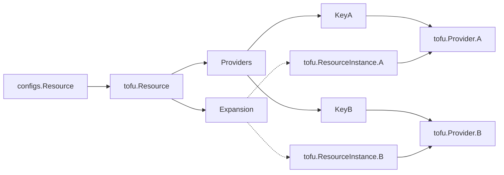

# Static Evaluation of Provider Iteration

Issue: https://github.com/opentofu/opentofu/issues/300

Since the introduction of for_each/count, users have been trying to use each/count in provider configurations and resource/module mappings. Providers are a special case throughout OpenTofu and interacting with them either as a user or developer requires significant care.

> [!Note]
> Please read [Provider References](../docs/provider-references.md) before diving into this section! This document uses the same terminology and formatting.

## Proposed Solution

The approach proposed in the [Static Evaluation RFC](20240513-static-evaluation.md) can be extended to support provider for_each/count with some clever code and lots of testing. It is assumed that the reader has gone through the Static Evaluation RFC thoroughly before continuing here.

### User Documentation

#### Provider Configuration Expansion

First, we need to define what is expected when a user adds for_each/count to a provider configuration:
```hcl
locals {
  regions = {"us": "us-east-1", "eu": "eu-west-1"}
}

provider "aws" {
  for_each = local.regions
  region = each.value
}
```

At first glance, this looks fairly straightforward. Following the rules in place with resources, we would expect `aws["us"]` and `aws["eu"]` to be valid.

What happens if you have another aws provider with the alias of `"us"` (`aws.us`)? That would be incredibly confusing to end users. Therefore, we should consider that provider "indices" and provider aliases are identical concepts. In that previous example both `aws["us"]` and `aws.us` would both be defined.


Providers already have an alias field, how will this interact with for_each/count?
```hcl
provider "aws" {
  for_each = local.regions
  alias = "HARDCODED"
  region = each.value
}
```

This would produce two provider configurations: `aws.HARDCODED` and `aws.HARDCODED`, an obvious conflict. We could try to be smart and try to make sure that the keys are identical and in some way derived from the iteration. That approach is complex, likely error prone, and confusing to the user. Instead, we should not allow users to provide the alias field when for_each/count are present.


What if a user tries to use a resource output in a provider for_each? In an ideal world, this would be allowed as long as there is not a cyclic dependency. However, due to the way providers are resolved deep in OpenTofu this would require a near rewrite of the core provider logic. Here we rely on the ideas set forth in the Static Evaluation RFC and only allow values known during configuration processing (locals/vars). Anything dynamic like resources/data will be forbidden for now.


With the provider references clarified, we can now use the providers defined above in resources:

```hcl
resource "aws_s3_bucket" "primary" {
  for_each = local.regions
  provider = aws.us # Uses the existing reference format
}

locals {
  region = "eu"
}

module "mod" {
  source = "./mod"
  providers {
    aws = aws[local.region] # Uses the new reference format.
  }
}
```


#### Provider Alias Mappings

Now that we can reference providers via variables, how should this interact with for_each / count in resources and modules?

```hcl
locals {
  regions = {"us": "us-east-1", "eu": "eu-west-1"}
}

provider "aws" {
  for_each = local.regions
  region = each.value
}

resource "aws_s3_bucket" "primary" {
  for_each = local.regions
  provider = aws[each.key]
}

module "mod" {
  for_each = local.regions
  source = "./mod"
  providers {
    aws = aws[each.key]
  }
}
```

From a user perspective, this provider mapping fairly simple to understand. As we will show in the Technical Approach, this will be quite difficult to implement.


#### What's not currently allowed

There are scenarios that users might think could work, but we don't want to support at this time.


Storing a provider reference in a local or passing it as a variable
```hcl
locals {
  my_provider = aws["us"]
}

resource "aws_s3_bucket" "primary" {
  provider = local.my_provider
}
```
It's not well defined what a "provider reference" is outside of a "provider/providers" block. All of the provider references are built as special cases that are handed beside the code and not as part of it directly.


Using the "splat/*" operator in module providers block:
```hcl
module "mod" {
  source = "./mod"
  providers {
    aws[*] = aws[*]
  }
}
```
This implies that all aliased aws providers would be passed into the child module.

### Technical Approach

#### Provider Configuration Expansion

##### Expansion

Expanding provider configurations can be done using the StaticContext available in `configs.NewModule()` as defined in the Static Evaluation RFC.

At the end of the NewModule constructor, the configured provider's aliases can be expanded using the each/count, similar to how [module.ProviderLocalNames](https://github.com/opentofu/opentofu/blob/290fbd66d3f95d3fa413534c4d5e14ef7d95ea2e/internal/configs/module.go#L186) is generated. This does not require any special workarounds and will resemble most other applications of the StaticContext.

New validation rules will be added per the User Documentation above, all of which closely resemble existing checks and do not require engineering discussion.

##### Evaluation

Using static variables in provider/providers fields is also fairly straightforward. We use the StaticContext as designed to evaluate the expression.

However, there is a bit of a snag. Due to how the HCL package is designed, we can't directly evaluate `aws["foo"]` without knowing the values of the `aws` map. We will need to defer evaluating the provider/providers block until after the each/count expansion defined above is run. Once the full map of local provider names is known in the module, it can be used to check and evaluate the provider/providers fields. This deferred evaluation will be done in the NewModule constructor as well.

#### Provider Alias Mappings

I'll preface this by saying that this understanding of the current OpenTofu code may be incorrect or incomplete. It is a wild mix of legacy patterns and fallbacks that is hard to reason about. It is based on [Provider References](../docs/provider-references.md#Provider-Workflow)

Providers and there aliases are:
* Fully known at init/config time
* Hacked into the graph via ProviderTransformers
* Attached to *Unexpanded* modules/resources in the graph
* Linked to *Unexpanded* resources in the graph.

Let's desconstruct each of these challenges individually:

##### Providers through Init/Configuration:

Each configs.Module contains fields which define how the module understands it's local provider references and provider configurations. As defined in Expansion above, we can use the StaticContext to fully build out these maps.

The next piece of data that's import to the config layer is which `addrs.LocalProviderConfig` (and therefore `addrs.AbsProviderConfig`) a resource or module requires. The entire config system is (currently) blissfully unaware that instances of modules and resources may want different configurations of the same provider.

Resources and Modules can be queried about which provider they reference. Due to legacy / implicit reasons, it is a bit of a complex question. The Resource and Module structures contain `configs.ProviderConfigRefs`, which is a config-friendly version of `addrs.LocalProviderConfig` (includes ranges).

Interestingly the majority of the code that uses `configs.ProviderConfigRefs` only cares about using it to look up the `addrs.Provider` and *does not care about the alias*. This will be one of the keys to surgically adding in support for per-instance provider aliases.

We could therefore track a unaliased `addrs.LocalProviderConfig` (which points to an `addrs.Provider`) through most of the config code, and maintain a map within resources/modules that define "Instance Key" -> "Provider Alias" to be used much later on when that information is actually required.

##### Providers in the graph

As previously mentioned, the ProviderTransformers are tasked with inspecting the providers defined in configuration and attatching them to resources.

They inspect all nodes in the graph that say "Hey I require a Provider!" AKA `tofu.GraphNodeProviderConsumer`. This interface allows nodes to specify a single provider that they require be configured (if applicable) before being evaluated.

As mentioned before, one of the key issues is that *unexpanded* resources don't currently understand the concept of different provider aliases for the instances they will expand into. With the "Instance Key" -> "Provider Alias" map created in the previous section, the unexpanded resource can now understand and needs to express that each instance depends on a specific aliased `addrs.AbsProviderConfig` (all with the same `addrs.Provider`). By changing the `tofu.GraphNodeProviderConsumer` to allow dependencies on a set of providers instead of a single provider, all of the required configured providers will be initialized before any instances are executed.

The unexpanded resource depending on all required configured provider nodes is critical for two reasons:
* The provider transformers try to identify unused providers and remove them from the graph. This happens pre-expansion before the instanced links are established.
* A core assumption of the code is that expanded instances depend on identical or a subset of references that the unexpanded nodes do.


That's a lot to take in, a diagram may be clearer:


That shows that although each tofu.ResourceInstance depends on a single provider alias, to evaluate and expand the tofu.Resource, all of the providers required for the instances must already be initialized and configured.

It is also worth noting that for "tofu validate" (also run pre plan/apply), the graph is walked *unexpanded* but still uses the providers to validate the config schema. Although we are allowing different "Configured Provider Instances" for each ResourceInstance, the actual "addrs.Provider" must remain the same.

Although complex, this approach builds on top of and expands existing structures within the OpenTofu codebase. It is evolutionary, not revolutionary as compared to [Static Module Expansion](20240513-static-evaluation/module-expansion.md).

##### Providers in the State

This is the last "tall pole" to knock down for instanced provider alias mapping.

The state currently is formatted in such a way that the `addrs.AbsProviderConfig` of an *unexpanded* resource is serialized and attached to the resource itself and not each instance.

Example (with relavent fields only):
```json
{
  "module": "module.dummy",
  "type": "tfcoremock_simple_resource",
  "name": "resource",
  "provider": "module.dummy.provider[\"registry.opentofu.org/hashicorp/tfcoremock\"].alias",
  "instances": [
    {
      "index_key": "first"
    },
    {
      "index_key": "second"
    }
  ]
}
```

The simplest path forward is to use an un-aliased value for the provider if multiple aliases for the instances are detected. The provider could then be overridden by each instance.

```json
{
  "module": "module.dummy",
  "type": "tfcoremock_simple_resource",
  "name": "resource",
  "provider": "module.dummy.provider[\"registry.opentofu.org/hashicorp/tfcoremock\"]",
  "instances": [
    {
      "index_key": "first",
      "provider": "module.dummy.provider[\"registry.opentofu.org/hashicorp/tfcoremock\"].firstalias"
    },
    {
      "index_key": "second",
      "provider": "module.dummy.provider[\"registry.opentofu.org/hashicorp/tfcoremock\"].secondalias"
    }
  ]
}
```

This change would keep the state file reasonably compatible and not require a new version. Inspecting the history of the state file versioning, this fits well within changes allowed in the same version.


#### Module Provider Map

The module providers block already deals with provider aliases and has complex resolution logic baked into the config package. This logic validates the required and implied providers, as well as fully filling out the provider mapping throughout the module config tree.

All of that logic boils down into a simplified view of what `addrs.AbsProviderConfig`s are available globally and how `addrs.LocalProviderConfig`s map to them at a module level.

By making the `config.Module`'s provider data indexable by an instance key, we can provide still directly provide that view while allowing index information to be preserved.

This section is not fully fleshed out, but should be reasonable to implement given what is currently known about the provider reference structures.

### Open Questions

Should variables be allowed in required_providers now or in the future?  Could help with versioning / swapping out for testing?
```hcl
variable "version" {
    type = string
}
terraform {
    required_providers {
        aws = {
            source = "hashicorp/aws"
            version = var.aws_version
        }
    }
}
```

There's also an ongoing discussion on allowing variable names in provider aliases.
Example:
```
# Why would you want to do this?  It looks like terraform deprecated this some time after 0.11.
provider "aws" {
  alias = var.foo
}
```

### Future Considerations

## Potential Alternatives

Go the route of expanded modules/resources as detailed in [Static Module Expansion](20240513-static-evaluation/module-expansion.md)
- Concept has been explored for modules
- Not yet explored for resources
- Massive development and testing effort!

