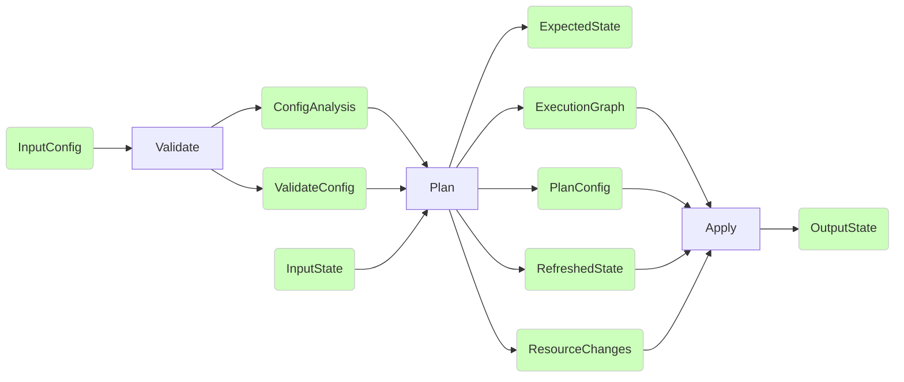

# Revisiting OpenTofu's core Architecture

As with many codebases of this size, age, and popularity, it has arguably outgrown it's initial design. Further additions to the codebase within the current architecture have it groaning at the seams.  This can be quantified both by the time it takes to add new complex features and by how long it takes to properly onboard a qualified developer (months).

This RFC discusses a proposed future architecture which would address that primary concern of outgrowing the current design, while keeping an eye on both performance and potential feature additions.

We do not propose an exact path to achieve this goal, but instead expect that multiple smaller RFCs will follow to help describe progress toward this shared vision.

## OpenTofu's fundamental requirements:

OpenTofu performs "operations" such as "validate", "plan", "apply" on a given configuration and state.  Each of these actions follows the general pattern of iterating through the configuration and the state to produce an output state and error messages, where the output state should match what was specified by the configuration as closely as possible.

The configuration contains elements which either represent desired entities in the state file or are intermediate values used to link other elements together.

In a given action, OpenTofu must answer the following questions:
* What new entities need to be added to the state (create)
* What changes need to be made to entities which already in the state (update)
* What entities should not exist in the state (destroy)
* What order should these changes be made within the operation?

## Current Architecture

OpenTofu builds a graph from the configuration and state to answer the questions above.  Once the graph has been built, it walks through the graph to produce the resulting state and messages. The docs contains a more in-depth write-up and should be used as reference https://github.com/opentofu/opentofu/blob/main/docs/architecture.md.

The graph is made up of nodes which each correspond to an element within the configuration, state, or both.  Each of these nodes are able to express what dependencies they have on other nodes, as well as the action it will take during the graph walk.  The dependencies on other nodes are used to build the edges in the graph.

This describes a relatively simple process, but has grown in complexity over time and with more complex requirements.

### Where the complexity has grown

#### Dynamic instances of everything

In the earliest usable versions of this software, the relationship between the static configuration structure and the dynamic execution graph was relatively straightforward: `resource` blocks supported `count`, but it supported only a constant value not derived from anything else, and nothing else in the language supported any sort of dynamic repetition at all.

These requirements grew over time, first to support resource `count` referring to dynamic data from elsewhere in the configuration, and later to module-level repetition which therefore made it necessary for _everything that can be declared in a module_ to support multi-instancing, thereby making the initial static execution graph a very poor approximation of the actual execution behavior.

That means that additional layers have been added on over time to deal with that additional complexity outside of the dependency graph, but the execution model is still highly dominated by the naive graph traversal and so the resulting logic is very hard to follow and maintain correctly.

Significant changes related to this (included just as a historical overview of how things evolved; no need to read all of the details!):

- [The original static-only resource `count` feature](https://github.com/opentofu/opentofu/compare/17074e5ae6507e67f21172d404ac9420f3c73a29...3b3c9e140ae59775091b3fb89b10d997fa94f068)
- [Allowing resource `count` to refer to other symbols](https://github.com/opentofu/opentofu/compare/95f43d823023ec3b6b07eefee5b92a8732385c19...66c58788fe6031fb25a58adf718c05d54ce759be) (but only those that can be evaluated during graph construction)
- [A huge rewrite of the graph system with many changes](https://github.com/opentofu/opentofu/compare/8463c921027acde225bf549f674501212da99565...4b6f258f1fe23e99d660cf652480314933d81626), but notably it introduced the idea of "dynamic expansion" for the first time so that `count` could be handled dynamically during the graph walk, rather than during graph construction.
- [Allowing `count` to refer to known resource instance attributes](https://github.com/opentofu/opentofu/compare/dd6d025dbba7b9858ae543b17c227e49e449a81e...dd8ee38ba83dbad2db2742bf0b4d094a934cadef), effectively introducing the possibility of dynamic failure if `count` refers to something unknown.
- [Apply phase gets its own graph builder](https://github.com/opentofu/opentofu/compare/0fe51b334cb0d6e8cb99cb12ac7ad24b92a298d6...fee0351c660828a09eeccc1c68efc578b8e1676d) so that to can begin with already-expanded resource instances, and only the subset that actually have changes pending, to avoid redoing all of the `count` evaluation and planning logic.
- [Plan phase graph building gets simplified](https://github.com/opentofu/opentofu/compare/f9fee4106f3e53750c795cfe92dc5b51db52fc1f...838fe2af9bbdce2fa5449f6c30551d99176ca56b) so it no longer deals with apply-phase-only complexity like the separation of the "create/update" and "delete" steps of something being replaced.
- [The "local values" concept](https://github.com/opentofu/opentofu/compare/e2272f71a0ccc8d1217a25cfb44fbe996e6ec40a...3a30bfe845455125bbe4b201f8de0457ef3639de), which was the first entirely new concept added since adopting the separated graph builder model.
- [A very messy reorganization to switch to using HCL 2's concepts](https://github.com/opentofu/opentofu/compare/2c70d884d6a3de8ad6aaf8230a37c0c1b17ba9cb...c937c06a03386caee280c36ee10eebeb0dc7813b). In particular, this introduced our current treatment of using `hcl.Expression.Variables` to discover what other objects an expression refers to as part of building the dependency graph, and with it the need for roughly everything to have access to provider schemas.
- [Support for `for_each` as a new kind of repetition for resources](https://github.com/opentofu/opentofu/compare/16fa18c139b5460b81b09779ee57dab0bb661949...e7d8ac5ad705734cccbe3b35662df3b0d58fbe1e)
- [`instances.Expander` generalizes the handling of `count` and `for_each` in preparation for module-level repetition](https://github.com/opentofu/opentofu/compare/657f9502e46b508ff355951924f5652ce783af87...c02a89899451850cf055f593e5e1a9780ddb2bce)
- [Support for `count` and `for_each` on modules](https://github.com/opentofu/opentofu/compare/d095f572901208068114eb612fb9d17bd04ac07c...c2499433600577934c70a7b758cdb13c420242e7), which made effectively _everything_ need to support dynamic expansion.
- [`for_each` for provider configurations](https://github.com/opentofu/opentofu/compare/3d4bf29c56768f87a992de6f51188fd88685733b...fd775f0fe3f8457a01e101fb62573f3072764c76), which was implemented primarily as a static eval feature due to the complexity of retrofitting this as a dynamic expansion on top of all of the above. (Discussion about the abandoned dynamic alternative in [opentofu/opentofu#2088](https://github.com/opentofu/opentofu/pull/2088).)

#### Relative ordering of create/update and destroy actions

One of OpenTofu's most important responsibilities is making sure that operations happen in an appropriate order based on the dependencies declared in the configuration. However, that is _far_ easier said than it is done, in large part because there is no single "appropriate order" that applies in all cases.

The system was originally pretty naive, just visiting each resource in an order decided by the references between them and executing a "destroy" operation if necessary and then a "create" or "update" operation if necessary. But that's already wrong because destroy operations need to happen in reverse order so that when B depends on A, the system doesn't try to destroy A before B has been destroyed.

So the first complication was in separating create/update from destroy so that they could have inverted dependency ordering. But that was only the beginning of the complexity:

- When a particular plan contains a mixture of create/update and destroys for different resources, they must be sequenced such that the relative ordering of any pair of actions respect the dependencies between them, which tends to lead to destroying a number of different things before creating or updating others.
- When an object needs to be "replaced" to change an immutable argument, it's often better to create the new object before destroying the old one so that there's briefly two objects rather than briefly zero objects, but conversely there are some object types where that's impossible because the object is effectively a singleton, or because it has other more complicated uniqueness constraints.
- Different APIs have different opinions about how dependent objects interact: sometimes when A depends on B an attempt to destroy B will implicitly destroy A, but other times destroying B will fail until A is destroyed.

Therefore the handling of the interaction between create/update and destroy actions has ballooned in complexity over time, and even the current implementation does not properly model all reasonable remote API designs. The implementation has become so complicated and so sprawled throughout the system that it is very challenging to evolve and very challenging to debug when someone reports an issue. Sometimes it's even hard to determine if a certain behavior is consistent with the intended design or not, because "the intended design" isn't a single coherent system but rather a set of interacting and sometimes-contradictory requirements, some of which are documented in [OpenTofu Core Resource Destruction Notes](https://github.com/opentofu/opentofu/blob/f827ea1f2ba59b670177566c00b8be2a9c071c36/docs/destroying.md).

Historical changes related to this:

- [Original modelling of the idea that some arguments can't change without replacing the remote object](https://github.com/opentofu/opentofu/compare/fac68b0c09c87caae841b2ad64d4f981588b4c6e...469d20afe3eaa703f1662e0a7231c59bb7b267c4) (no actual handling of that yet)
- [Original modelling of the idea that a whole object might just need to be destroyed](https://github.com/opentofu/opentofu/compare/d54034d0b5ecd75385ec228e1dd27560695d60f7...9c024994b7bbc5928653e8c8039dbd1a694c2510) (no actual handling of that yet)
- [Adding separate graph nodes for destroy actions](https://github.com/opentofu/opentofu/compare/6f274eb7a924e15017da843c80895b651b84e324...2d72164c6a6718ab33245b9bbdf4b9e1fc04ed5c), including the special treatment of transitive dependencies being destroyed.
- [Original `create_before_destroy` implementation](https://github.com/opentofu/opentofu/compare/a8c730d7a4048cbd5187755f3376e296b5fd07e5...aef7718778ad79c6d9ececbccb5a6514f991a0a2), which treated it as a single-resource idea but did not properly handle transitive dependencies with other resources that don't set this flag, causing dependency cycles as described in [hashicorp/terraform#2493](https://github.com/hashicorp/terraform/issues/2493).
- [A huge rewrite of the graph system with many changes](https://github.com/opentofu/opentofu/compare/8463c921027acde225bf549f674501212da99565...4b6f258f1fe23e99d660cf652480314933d81626), which introduced the graph transformers related to destroying.
- [Fixing a subtle bug that was hard to spot due to the destroy-related code being so distributed around the code](https://github.com/opentofu/opentofu/compare/74386655a5b4bcc1123a00715637b302b119f824...7031cb145c7c24aceb00f6002689452df75d2771); this was for [hashicorp/terraform#2363](https://github.com/hashicorp/terraform/issues/2363)
- [Fixing another quirky destroy-related bug with cross-module dependencies through output values](https://github.com/opentofu/opentofu/compare/008b8b4c23e9f6eb16beef706b269bc7b6e1bc87...f6161a7dc9dc56ab84e52cb4c6436073c4ed45c7); this is part of a series of changes that caused the destroy edge transformer to grow to eventually replicate most of the graph building process itself in order to produce an accurate result
- [Automatically force `create_before_destroy` on anything else in a dependency chain](https://github.com/opentofu/opentofu/compare/9cc881558b8cb477d608663845313d208bc67390...cf3a259cd9fd78bb9f2bc0949866b0708a48c10e): this made the system automatically handle the flaw where `create_before_destroy` had to be set consistently on everything a dependency chain, initially motivated by working with data resources (since they don't have an explicit `create_before_destroy` argument to set) but this applied to managed resources too. (This initial commit was not sufficient to fully solve the problem, and there were various followup fixes, but that's too much detail for this already-long list.)
- [Destroy-time provisioners](https://github.com/opentofu/opentofu/compare/928fce71f72c3821508b935d166504a04d91dbd6...e9f6c9c429a92ea0644ae3640fc31872d971128c) which inadvertently introduced lots of extra complexity because the destroy phase of one resource instance could now depend (via expression references) on the update phase of another resource instance, but this design mistake would not be discovered until much later.
- [Tracking `create_before_destroy` in state](https://github.com/opentofu/opentofu/compare/ded207f3b86a68d0d2c142b94927ccbcfc290e54...691bb6b9077483d3d78966f1d8cb8920879559cd): it initially seemed like create-before-destroy was a config-only problem, but because of the need to propagate up and down dependency chains it also interacted with "orphaned" resources that were only present in the state, and so needed to be tracked there too.
- [Destroy transformer no longer needs to repeat most of the graph-building process](https://github.com/opentofu/opentofu/compare/45f2a61bdb22c71202baf6eaa6d620fcdbdd1c24...8b5522a090bdee8ca5000d29defc45bab59d8359): due to the previous item and some other similar changes, it was now possible to rely only on the main graph and metadata in the state when calculating the needed destroy edges, leaving this transformer in mostly the same shape as in today's OpenTofu.

#### Refactoring

For a long time the system supported rebinding existing objects to different resource instance addresses only as a special "out-of-band" operation using the command [`tofu state mv`](https://opentofu.org/docs/v1.9/cli/commands/state/mv/), which meant that the main language runtime could generally assume that all objects would have a fixed resource instance address throughout an entire plan/apply round.

However, treating address rebinding as an out-of-band meant that it didn't fit in well to the typical OpenTofu workflow: the configuration and state both need to change together for such a change to be effective, but `tofu state mv` only updates the state and so teams using it would need to either first update their shared configuration (in version control) and then run `tofu state mv`, or conversely to run `tofu state mv` and _then_ update the shared configuration to match, in both cases creating a window of time where the configuration and state are inconsistent and so anyone concurrently running a normal plan/apply round could cause the affected objects to be destroyed completely.

To help address that, today's OpenTofu includes [language features for "refactoring"](https://opentofu.org/docs/language/modules/develop/refactoring/) which work, in essence, by asking authors to describe configuration changes that would require state updates as part of the configuration, and then OpenTofu uses that extra information to propose to update the state to match during the next plan/apply round.

The language runtime fundamentally assumes that all objects have fixed resource instance addresses throughout a plan/apply round though, so in practice those features were implemented as a special extra preprocessing step that makes changes to the state before the plan graph construction begins. That preprocessing step needs to take into account dependencies itself, and so it ends up needing to deal with several concerns that the language runtime also shares but yet very little code can be shared between the two.

Additionally, resource instance addresses include a dynamic instance key part but yet the preprocessing step to handle the moves cannot know which instance keys each resource has in the desired state, because the desired state hasn't been created yet. Therefore the system has a counter-intuitive design where the preprocessing step optimistically assumes that the instance keys in source addresses are valid, and then retroactively checks if they were only after the planning phase has completed.

These constraints cause the implementation of the refactoring features to be more complicated, and also constrained the refactoring blocks to only supporting static expressions because they must be handled before the main evaluation process can start, and thus before dynamic expressions can be evaluated. That led, for example, to [opentofu/opentofu#1475](https://github.com/opentofu/opentofu/issues/1475). Although we cannot be certain that dealing with address changes as part of the main execution is _sufficient_ to support more-dynamic situations, it does seem to be _necessary_.

Historical changes related to this:
- [Introducing the `refactoring.ApplyMoves` and `refactoring.ValidateMoves` calls, which sandwich the main planning process](https://github.com/opentofu/opentofu/compare/57d36c1d9da193448f58b35ce043ae55f71d9c82...f76a3467dcfaab6fa7cc25c843ef92cfbf602fea)
- [Big rework of the public `context.Context` API so that `refactoring.ApplyMoves` could be called at a suitable time relative to everything else](https://github.com/opentofu/opentofu/compare/4faac6ee43872d9f7c413a176152f1b76a77eec6...89b05050ec0d1cae275fb9a3072e85364ba37a22)

### What are known performance issues:
* Lack of provider bulk actions
* Near global state access and modification
* Inability to resolve detailed references
  - foo[4].thing currently fully resolves all instances of foo and all outputs, not just .thing

## What are we proposing?

We are proposing a major design change to OpenTofu's internal architecture, focusing on breaking apart the complexity of the graph operations above.

Operations today re-use a lot of the same concepts and code throughout their execution.  In practice, this means that a lot of work needs to be repeated between operations.  It is also complicated that the expected result of a given codepath may change dramatically based on the operation, leading to hard to trace bugs.

In short, we have several general purpose structures and concepts that are heavily re-used in ways that are not ideal.  Althought code re-use should be a goal we strive for, doing so in to aggressive of a fashion can lead to hard to maintain patterns and brittle designs.

Therefore, we propose to form a stronger conceptual chain between the three classes of operations, Validate, Plan, and Apply.  Each operation class would have a clear set of non-overlapping responsibilities that would feed into the next link in the chain.

The main conceptual difference between this model and what exists today is that each operation bases it's execution primarily on the prior operation's output, instead of trying to replicate similar logic that's been twisted for the current operation.

For example, today Apply builds a similar graph to Plan.  The graphs differ in several important ways, but it is hard to know what is an intentional difference and what is a bug.  Consider if Plan outputs a set of "actions" to take during the Apply, such that Apply is relegated to stepping through what the Plan explicitly laid out.

This diagram should serve as a conceptual representation of what this could look like, but is not prescribing an exact implementation.  That is reserved for followup prototyping and RFCs.

In this diagram, we can see that each component has a clear job of taking a specific input and transforming it to the expected outputs.

Let's follow this diagram through running `tofu apply` on a project:
1. The configuration is parsed and basic sanity checks are performed
2. The validate step accepts the configuration and produces a validated configuration and configuration references
   - The majority of static evaluation could be moved into this step (perhaps renaming the step to "Load" or "Build" would be better)
   - Configuration References is a structure which can answer questions about the relationship between elements in the configuration
     - What provider configuration is required in different modules/resources
     - What resources a resource depends upon (for situations like ephemeral and ordering)
3. The plan step accepts the output from validate, as well as the current state, and produces everything needed for the apply step 
   - ExecutionGraph is a structure which completely represents the actions needed to be taken in apply and their interdependencies
     - It completely encapsulates complex logic like the difference between update/replace and the create_before_destory modifier
   - ResourceChanges is a structure which stores the state change information for elements described in the ExecutionGraph
     - It is unclear if this should be subsumed by the ExecutionGraph
   - The RefreshState is a structure which represents the "provider refreshed" understanding of the input state, where elements may have drifted
     - It is unclear if this should be subsumed by the ExecutionGraph or ResourceChanges
   - The PlanConfig in this representation is simply a passthrough
   - ExpectedState is only used during UI output and could potentially be omitted in a future iteration
4. The apply step accepts the output from plan and produces the output state
   - Apply should be as simple as possible, only following the path layed out by plan and not deviating

It is unclear at this juncture if several of the distinct outputs of the plan step should instead be represented as a homogeneous structure, instead of being represented piecemeal.  For the purposes of this discussion they are distinct, in order to more closely model details the current architecture.

This process could be alternately thought of as a variant of "Parse, Compile, Execute".

## How do these changes solve the stated problem?

By separating opentofu's execution into compartmentalized and distinct concerns:
  - We reduce unintentional side effects when modifying distinct portions of the codebase
  - We are able to test components individually and thoroughly, in a more focused manner
  - With structures and logic tailored to the given operation (as opposed to the more general purpose approach), measuring and improving performance can happen with less overhead and less risk

It does not try to constrain or reduce the complexity of what OpenTofu can do in a given operation, and instead should allow for easier expansion in the future.

## Implementation Path

As mentioned above, the implementation of these concepts is to large of a topic to cover in a single RFC.  However we set a goal of incremental changes to the architecture.

In an ideal world, we would be able to make the new "execution engine" opt-in for a period of time.  In practice, this may not be possible to hold to that exact ideal.  We should attempt to reduce the "churn" of each step toward this architecture by re-using and adapting as many existing constructs within the codebase as possible.  All of the sub-rfcs should discuss this in detail.

## Open Questions:
* Does what we propose impact our ability to implement Deferred Actions / unknown count+for_each?
  - Is this a workflow that will be important to OpenTofu?
  - The current thoughts from some of the Maintainers is that Deferred Actions should not be too problematic to inject into this design if and when it's neede
  - Unknown count and for_each would be much harder to implement.  The author believes that this is not an important workflow for OpenTofu and the existing solution of target/exclude is sufficient.

## Related Proposals
* [Remove Graph Dynamic Expand](https://github.com/opentofu/opentofu/pull/2285)
