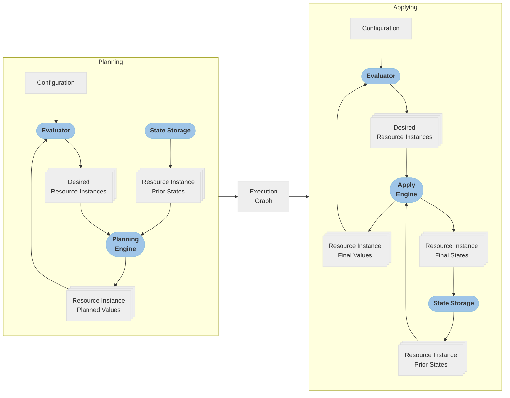
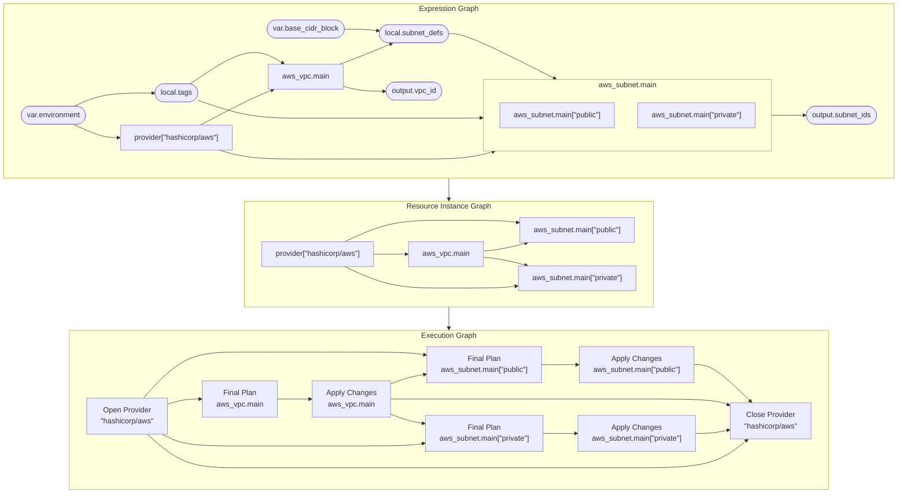
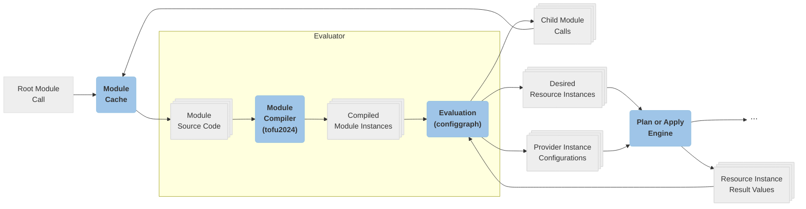
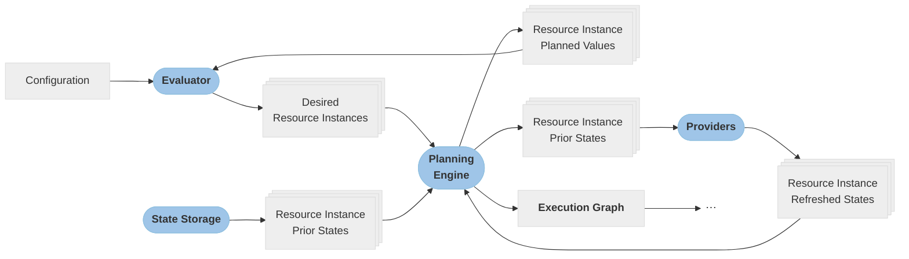
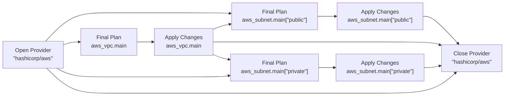
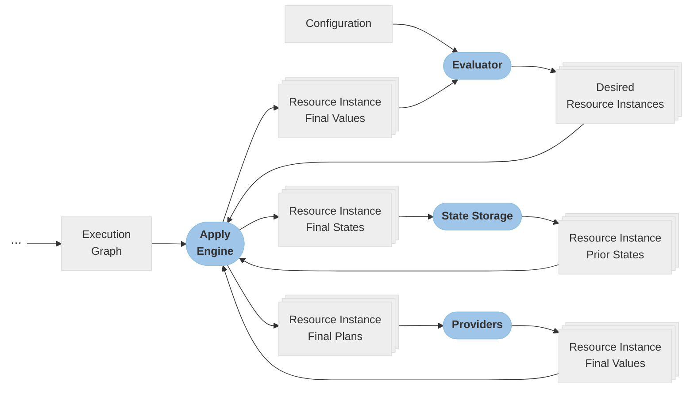

# A new approach to configuration evaluation, planning, and applying

This RFC is a continuation of the design discussion previously started in
[Revisiting OpenTofu's core Architecture](./20250728-execution-architecture.md).
That document focused mainly on the problems we were hoping to address, while
_this_ document is discussing a specific technical design that addresses many of
those problems.

At the time of writing this we already have an initial practical implementation
of most (but not all) of these ideas in [opentofu/opentofu#3191](https://github.com/opentofu/opentofu/pull/3191).
This writeup aims to be at more conceptual level, discussing the overall
architectural ideas without getting into the implementation details too much.
As a result, some of the descriptions and diagrams intentionally gloss over
some implementation-level complexity, and so what's described here doesn't
_exactly_ match the initial implementation.

In practice we expect that those implementation details will continue to evolve
as we iterate. The goal of this RFC is only to document the general direction
we'd be heading in, so that we can hopefully find concensus on the architectural
goals and then use that to inform the ongoing implementation work.

This document assumes that the reader is already familiar with the historical
context described in the previous document. Instead of repeating all of that
again in different words, we'll just jump directly into describing the proposed
design direction.

## Table of Contents

- [Overview](#overview)
- [The Evaluator](#the-evaluator)
  - [Compilation vs. Evaluation](#compilation-vs-evaluation)
  - [Concurrent Dynamic Analysis](#concurrent-dynamic-analysis)
  - [Interaction with Phase-specific Code](#interaction-with-phase-specific-code)
- [The Planning Engine](#the-planning-engine)
  - [Provider Instances During the Planning Phase](#provider-instances-during-the-planning-phase)
  - ["Deposed" Objects](#deposed-objects)
- [The Apply Engine](#the-apply-engine)
  - [Saving Execution Graphs to Disk](#saving-execution-graphs-to-disk)
- [Known Concerns and Open Questions](#known-concerns-and-open-questions)
  - [Overall Implementation Strategy](#overall-implementation-strategy)
  - [Provider-defined Functions on Configured Providers](#provider-defined-functions-on-configured-providers)

> [!NOTE]
>
> Some of the sections end with callout notes like this which refer to concrete
> implementations of what was discussed from our initial implementation sketch.
>
> At this draft stage those are imprecise references by just naming symbols
> and package paths. We're hoping to land a form of that implementation sketch
> in the `main` branch in the near future as a starting point for ongoing
> implementation work, and if we do so then I intend to retroactively update
> this document to link directly to that merged code for easier navigation.
> I'm just deferring that for now because the specific commits on that branch
> are likely to get rewritten and thus garbage collected so that direct
> permalinks to files in those commits would stop working.

## Overview

Overall, this new design approach draws some more explicit boundaries between
different parts of the system that are not so strongly delineated today.

There are multiple ways to think about these boundaries. The way we most
commonly talk about it is to describe OpenTofu doing work in _phases_. This
new architectural approach has two main phases:



* **Planning:** Broadly, this means to use the provided configuration to
  discover the "desired state" -- which resource instances ought to exist --
  and the relationships between them and the providers that manage them. It
  then compares that with the _current_ state and identifies any differences.

    This phase then proposes various specific actions that need to be taken
    to bring the remote systems closer to the desired state, but instead of
    immediately performing those actions it describes them as an
    _execution graph_ for handling in the next phase.

* **Applying:** The planning phase produced a graph of specific actions that
  should be taken to modify the remote systems, and so the apply phase is
  responsible for actually performing those actions in a suitable order based
  on the constraints described in the execution graph.

    In current OpenTofu this phase ends up re-running a lot of the logic from
    the planning phase in the hope of producing an equivalent result. In this
    new approach instead the planning phase describes the execution graph in
    a form that can be saved as part of a plan file, and so the apply engine
    merely needs to "do what it's told" by reloading that graph and executing
    the steps exactly as prescribed.

Each of these phases involve different main logic, but they share a significant
component in common: the _evaluator_. The job of the evaluator is to encapsulate
the handling of all of the surface details of the OpenTofu language that exist
to make decentralized development possible, such as calls between modules and
values flowing between them, so that the main phase-specific logic can focus
only on the main objects that actually cause externally-visible side-effects:
resource instances, and the provider instances that manage them.

This then leads to a different way to think about the system conceptually:
instead of thinking about the different phases of work, we can instead think of
the series of transforms these phases are performing to move from the concepts
that module authors interact with to the concepts that the plan and apply phases
prefer to interact with:



- The **expression graph** is the most direct representation of what the module
  authors wrote in the configuration: a set of expressions that need to be
  evaluated, where some expressions refer to others and therefore all need to
  be evaluated in a suitable order.

    At this level an OpenTofu configuration is perhaps most similar to a
    spreadsheet, where each cell contains an expression and the expressions in
    some cells refer to the results of the expressions in other cells. Just
    like in a spreadsheet engine's implementation, OpenTofu needs to discover
    the relationships between those expressions and then evaluate them gradually
    until they have all been transformed into a final value.

    The expression graph is completely encapsulated inside the _evaluator_,
    because it's calculated identically in all phases but the rest of the
    system doesn't actually need all of the source-level detail, so the
    evaluator produces the next artifact as its primary result.

- The **resource instance graph** boils the expression graph down to just the
  essential elements that can potentially cause side-effects during the apply
  phase: resource instances and the provider instances that manage them.

    This form ignores details such as input variables, output values, and
    the fact that each module has its own separate namespace. If a resource
    instance configuration refers to a local value which in turn refers to the
    results from another resource instance then in the resource instance graph
    the local value is disregarded and we instead model just the dependency
    between the resource instances.

    The planning phase is driven primarily by the resource instance graph: it
    visits each resource instance reported by the evaluator and asks its
    associated provider to produce a plan by comparing the effective
    configuration with the current state. Based on the provider's answer,
    the planning phase then chooses a set of specific actions that would need
    to be taken to bring the remote system closer to the desired state, but
    instead of performing those actions directly it produces the next artifact
    for the apply phase to use.

- The **execution graph** expands the pure relationship information from the
  resource instance graph to a graph of specific actions that can cause
  externally-visible side effects, making sure that those actions happen in
  a suitable order that respects the dependencies from the resource instance
  graph and respects OpenTofu's own mechanical constraints.

    For example, if the provider's proposed plan for a resource instance
    was to replace the existing object with a new one matching the latest
    configuration then the _execution graph_ must capture the individual steps
    of destroying the previous object and creating the new object as separate
    nodes, ordering them appropriately based on the `create_before_destroy`
    settings in the resource configurations.

    The job of the apply phase is to perform all of the operations described
    in the execution graph, while ensuring that the dependencies between them
    are correctly respected, and that other constraints like OpenTofu's
    configurable concurrency limit are respected.

As a series of phases or as a series of graph variants are both valid lenses to
view the proposed new architecture through. These are two ways to describe the
same ideas, rather than two alternative approaches to choose between.

Overall then, the main goal of the new approach described in this document is
to draw more explicit boundaries between these phases and between these
artifacts, whereas the current OpenTofu language runtime has all of these
concerns muddled together in a way that makes it hard to follow what role each
component is playing and how the different components depend on one another.

The subsequent sections describe each of the main components in some more
detail.

## The Evaluator

The most central new concept in this proposal is the shared _evaluator_, which
is responsible for interpreting the source language as written by module
authors, evaluating all of the expressions inside of it (which will often refer
to one another), and then ultimately reporting:

- Which instance keys are declared for each object that supports dynamic
  instances using any of the meta-arguments `count`, `for_each`, and `enabled`.
- All of the resource instances that are declared as "desired", the
  configuration values associated with each one, the address of the provider
  instance that the resource instance is declared to belong to, and the
  dependencies between them that are either implied by expression references or
  declared explicitly using the `depends_on` meta-argument.
- The configuration values associated with each provider instance, and which
  other resource instances the provider instance itself depends on.
- Various other ancillary information that might influence exactly how the
  planning engine would ultimately decide to react to a difference between
  desired and current state of a resource instance, such as `moved`, `removed`,
  and `import` blocks.

    These are all essentially just additional settings belonging to resource
    instances, but the surface language allows declaring them in separate blocks
    so that those decisions can potentially be made in a different module to the
    one where the resources themselves are declared. The evaluator is
    therefore responsible for finding those associations and presenting them
    as if they were declared as part of the resource instance.

This intentionally flattens away various details that are useful to module
authors for maintainability and composition, but that don't _directly_ describe
the "desired state":

- Input variables, local values, and output values: these exist only to allow
  factoring out common code and splitting declarations into separate namespaces.
  It ultimately doesn't matter to any other part of the system whether one
  resource instance refers directly to another or whether that reference is
  indirect through an output value across a module boundary.
- The module tree: the rest of the system just sees a flat set of
  resource instance addresses, some of which happen to include
  module-instance-related prefixes just to honor the separate namespaces between
  the different module instances.
- The unexpanded source objects that "expand" into multiple instances during
  evaluation: for example, if `aws_instance.foo` uses `count = 2` then
  the evaluator announces that `aws_instance.foo[0]` and `aws_instance.foo[1]`
  both exist, but doesn't have anything to say about `aws_instance.foo`
  _as a whole_ except that its full set of instance keys is `[0, 1]`.



### Compilation vs. Evaluation

The evaluation subsystem is itself split into two parts:

- The "compile" step interacts directly with the HCL library to analyze the
  source-level language constructs in a particular module, and is responsible
  for defining the variables and functions available in that module's scope
  based on what is declared.

  The result is a higher-level description of the relationships between the
  objects declared in a particular module. In this representation the objects
  and expressions are represented more abstractly so that the specific
  interactions with HCL are hidden away.

- The "evaluate" step consumes the result of the "compile" step and actually
  visits all of the declared objects and evaluates their expressions, collecting
  any diagnostics for problems that might arise along the way.

  This part of the evaluator is not directly aware of HCL and so could _in
  principle_ handle objects declared in some other base language, although that
  remains very theoretical since until we have another concrete language to
  consider it's impossible to predict exactly which concepts would be common
  between that and HCL.

  More likely in the medium term is to support multiple variations of the
  HCL-based language, so that we can implement features that require some kind
  of breaking change to the language while preserving support for older
  configurations that were written for an earlier edition of the language.

In practice these two parts have a cyclic dependency between them: evaluating
one module can discover module calls referring to other modules, which must
then in turn be compiled and evaluated themselves. That causes some complexity
in the implementation, but does mean that it's possible in principle for
different modules in the same configuration to use different implementations
of "compile" so that we can support multiple editions of the language together
in the same configuration, as long as the differences between those editions
are private within each module's namespace.

> [!NOTE]
>
> If you'd like to learn more about how the compile and evaluate steps might
> be implemented in practice, refer to
> [the current implementation sketch](https://github.com/opentofu/opentofu/pull/3290).
>
> The "compile" step is primarily implemented in
> `lang/eval/internal/tofu2024`, which in turn produces instances
> of types from `lang/eval/internal/configgraph` that interact with
> each other in the evaluation step.

### Concurrent Dynamic Analysis

The current OpenTofu language runtime has a number of internal sub-phases of
evaluation, which notably means that analysis of dependencies always happens
completely before any expression evaluation can occur. This means that the
dependency graph for evaluation is built by _static analysis_, where OpenTofu
asks HCL which static references exist in each expression.

Consider the following example:

```hcl
variable "instance_count" {
  type = number
}

resource "foo" "example" {
  count = var.instance_count
}

resource "bar" "example" {
  count = var.instance_count

  foo_id = foo.example[count.index].id
}
```

The current language runtime's static analysis step can detect that the
`foo_id` argument in `bar.example` refers to both `foo.example` and
`count.index`, but it cannot "see" how each of those symbols is used, so
OpenTofu just conservatively assumes that all instances of `bar.example`
depend on all instances of `foo.example`.

In fact, because the current engine cannot evaluate expressions _at all_
until the dependency graph has been built, the `count` expressions in each
of the resource blocks cannot be evaluated until the graph has already been
built, and so the plan-time dependency graph is between _whole resources_
rather than between _resource instances_, and the decision about which instances
exist for each resource isn't made until OpenTofu begins visiting the graph
nodes and evaluating their associated expressions.

This means that overall OpenTofu's analysis of dependencies is considerably
more conservative than module authors might expect:

- Even though in practice `bar.example[1]` only needs the id from
  `foo.example[1]`, OpenTofu must still wait until `foo.example[0]`'s plan
  is complete before planning `bar.example[1]`, reducing opportunities for
  concurrent work and thus slowing down the planning phase.
- The `-target` and `-exclude` planning options are documented as accepting
  resource instance addresses, but in practice things don't really work properly
  when doing so because the graph pruning happens before the `count` expression
  has been resolved, and so `-target=bar.example[1]` causes both
  `foo.example[0]` and `foo.example[1]` to be included in the plan.
- It isn't possible for one instance of a resource to refer to another instance
  of the same resource, because OpenTofu currently wants to evaluate all
  instances of a resource before evaluating anything that depends on any
  instance of that resource.

A major design goal for the new evaluator is to perform dependency analysis and
expression evaluation _concurrently_, so that we can use the dynamic results
of evaluating expressions to determine exactly what they refer to. In
particular, the new evaluator can evaluate the `count = var.instance_count` of
each of those resources as soon as the value of `var.instance_count` is
available, without any concern for what any other part of the resource
configuration refers to. It then evaluates the `foo_id` argument from
`bar.example` twice, with `count.index` set to `0` and `1` respectively, and
then the evaluation system dynamically recognizes that evaluation of those
expressions must wait until there's a value for `foo.example[0]` or
`foo.example[1]`, blocking until a concurrent goroutine has provided those
values.

Finally, the dynamic result of `foo.example[0]` is
[marked](https://github.com/zclconf/go-cty/blob/main/docs/marks.md) as belonging
to the zeroth instance of `foo.example`, and so once that expression's result
is available the evaluator can determine _precisely_ that `bar.example[0]`
depends only on `foo.example[0]`, and not also on `foo.example[1]`.

This section focused on references between resource instances as the most
prominent example, but the underlying building blocks that allow us to
dynamically discover dependencies during evaluation have various other benefits
too, such as unifying what our current system calls "early evaluation" with
the main evaluation logic. Instead of having a completely separate evaluator
for obtaining that early information, we can instead use the same evaluator
but impose some additional rules on certain parts of the language. For example,
the logic which evaluates a `source` argument in a `module` block rejects any
value that we determine (through dynamic analysis) was derived from a resource
instance attribute, rather than imposing static-analysis constraints about
which specific _global symbols_ the module source argument is allowed to refer
to.

> [!NOTE]
>
> If you'd like to learn more about how concurrent expression evaluation and
> dynamic analysis might be implemented in practice, refer to
> [the current implementation sketch](https://github.com/opentofu/opentofu/pull/3290).
> The most relevant packages are `lang/eval/internal/configgraph`,
> `lang/eval/grapheval`, and `lang/exprs`.

### Interaction with Phase-specific Code

Although the evaluator aims to encapsulate as much as possible, there is one
need that the evaluator cannot solve entirely on its own: deciding the value
used to represent each resource instance.

Because resource instances are our main vehicle for modelling side-effects,
their treatment differs a lot between phases:

- During the planning phase, the value representing a resource instance is its
  "planned new state": a partial prediction of what the object should look like
  after changes have been applied, decided by the provider itself, with
  unknown values in any location where the provider cannot predict a result
  until after the side-effects have occured.
- During the applying phase, the value representing a resource instance is its
  "final new state": the value that the provider returned after making the
  actual changes to the remote system, which is required to be fully known.

The evaluator deals with these differences by requiring its caller to provide
an implementation of an interface which has a method that takes a description
of a "desired resource instance" -- its resource instance address, its
configuration values, and other meta-information such as which provider instance
it's associated with -- and returns a value that should be used to represent
that resource instance in ongoing evaluation.

The subsequent sections about the plan and apply engines will describe their
different approaches to this in more detail, but the common theme is that -- as
with so much of the behavior described above -- the evaluator and its caller
have a cyclic dependency between them where the configuration for one resource
instance might depend on the result value of another resource instance, and so
again the evaluator runs concurrently with its caller so that the two can
work alongside each other and trade work across the boundary of responsibility
as needed.

> [!NOTE]
>
> In [the current implementation sketch](https://github.com/opentofu/opentofu/pull/3290),
> the interface used by the evaluator to request information from its caller
> is called `Glue` in the package `lang/eval/internal/evalglue`,
> although there are higher-level wrappers around it to help adapt that
> API to each phase.
>
> For example, the planning engine implements `PlanGlue` instead, which is
> defined in `lang/eval`.

## The Planning Engine

The planning engine's job is to combine information produced by the evaluator
with information taken from the prior state and current remote system state to
decide which actions, if any, to take during a subsequent apply phase to change
the remote system to be closer to the desired state.



The order in which resource instances need to be "planned" is essentially the
same as the order of evaluating the expressions that define their configurations -- 
we typically want to plan a resource instance as soon as the needed data is
available -- and so the planning engine uses an inversion-of-control style
where it treats each new piece of information from the evaluator as an event
that can trigger planning work.

From the perspective of the planning engine there are various different "events"
generated by the evaluator which the planning process reacts to in different
ways:

- **All resources known for a module instance:** each time a module instance
  is compiled, the evaluator reports which resources (of all modes) are declared
  in it.

    The planning engine then checks the prior state for any resources that
    are not currently declared, and makes plans to delete or forget all
    instances of them.

- **All child module calls known for a module instance:** similar to the
  previous point, but for `module` blocks instead of resource declarations.

    In this case, all instances of all resources under the no-longer-desired
    module calls need to be deleted or forgotten together.

- **Instance keys decided for a resource:** once the `for_each`/etc arguments
  for a resource block have been resolved, the evaluator reports the full
  set of desired instance keys for the resource.

    The planning engine then checks the prior state for any instances of that
    resource which are _not_ desired, and makes plans to delete or forget them.

- **Instance keys decided for a module call:** similar to the previous point,
  but for the instances of a `module` block rather than for a resource.

    In this case, all instances of all resources under the no-longer-desired
    module instances need to be deleted or forgotten together.

- **A specific resource instance is desired:** finally, each resource instance
  that is currently declared in the configuration has its configuration
  value and associated metadata (i.e. which provider instance they use)
  reported.

    This is the main case: the planning engine responds by comparing the
    desired configuration with the current state (the result of refreshing)
    and, if necessary, proposes to create, update, or replace the remote
    object associated with that resource instance.

Each of the above events can therefore cause additional operations to be added
to the execution graph. The planning engine constructs the execution graph
gradually, on a per-resource-instance object basis, by adding just the
operations needed for a particular resource instance and then remembering which
of those operations produces the "final state" of the resource instance and
which represent opening and closing each provider instance, so that the
operations for downstream resource instances can be made to await the completion
of whatever they depends on, without needing to know the fine details of how the
other parts of the execution graph are shaped.



Considering again the relatively-simple example from earlier in the document,
the evaluator's report of "`aws_subnet.main["public"]` is desired" would
cause the planning engine to use the associated provider instance to learn if
any changes are needed for that resource instance, and if so the code handling
that specific resource instance would:

- Look up the graph nodes representing the opening and closing of
  `provider["hashicorp/aws"]`, adding them to the graph for the first time
  if they aren't already present.
  
  (In practice, this lazy-population of the two needed nodes is encapsulated in
  a helper function that takes a provider instance address and returns references
  either to newly-created nodes or nodes created by a previous call to the same
  function.)

- Look up the graph node that provides the final state for `aws_vpc.main`,
  which should already have been handled due to the natural order of expression
  evaluation in the evaluator.

- Add a new operation to the graph representing "create final plan" for
  `aws_subnet.main["public"]`, which depends on the nodes representing
  "open `provider["hashicorp/aws"]`" and the final state of
  `aws_vpc.main`.

- Add a new operation to the graph representing "apply final plan" for
  `aws_subnet.main["public"]`, which has the "create final plan" node
  and the provider instance open node as dependencies.

- Add the "apply final plan" node as a dependency of the
  "close `provider["hashicorp/aws"]`" node, so that the provider instance will
  remain open at least long enough to deal with `aws_subnet.main["public"]`'s
  operations.

  (Again in practice this is encapsulated a little so that the code handling
  the resource instance can just pass its "apply final plan" result to a
  helper function without needing to know exactly how the graph is being
  manipulated to recognize that.)

- Finally, record the "apply final plan" node as the operation that provides
  the final state for `aws_subnet.main["public"]`, so that any other downstream
  resource instance that might refer to this one (none, in this example) would
  be able to find it to record a dependency on it.

Overall this means that the code constructing the execution graph is directly
associated with the code which decides which action to take, which is quite
different from the current OpenTofu language runtime where the plan phase
only decides which action to take and then the execution graph is built
separately during the apply phase, after having to repeat much of the same work
to rediscover all of the necessary dependency edges.

After adding the needed nodes and edges to the execution graph, the "plan
desired resource instance" function then returns the placeholder result value
for the resource instance, which the evaluator will use to handle any references
to `aws_subnet.main["public"]` from elsewhere in the configuration. The
planning engine and evaluator therefore run concurrently and collaborate to
gradually progress through all of the resource instances declared in the
configuration, in expression-dependency order.

> [!NOTE]
>
> In [the current implementation sketch](https://github.com/opentofu/opentofu/pull/3290),
> the functionality described above is incomplete and not all connected together
> into a fully-functional system, because the first attempt at the planning
> engine was reusing the current system's model of planning instead of the new
> execution graph as a way to reduce scope while prototyping.
>
> However, various parts _are_ there to read if you're willing to use your
> imagination a little to think about how they would connect together in
> practice:
>
> - The evaluator delivers these "events" to the planning engine through
>   the planning engine's implementation of `eval.PlanGlue` from `lang/eval`,
>   which is struct type `planGlue` in the `engine/planning` package.
> - The above description focused mainly on the case of managed resource
>   instances that want to plan and apply changes, and the specific
>   implementations of handling those are in the `plan_managed.go` file in
>   `engine/planning`.
>
>     The code in there is currently stubbed out using existing state and
>     plan models, like `plans.ChangesSync`, rather than building an execution
>     graph as the text above describes.
>
>     Data and ephemeral resource instances require some different treatment
>     of course, so they'd have their own separate implementations that are
>     currently just stubbed out in the sketch tree.
> - Some machinery for building and running through execution graphs is
>   sketched out in `engine/internal/execgraph`. The test
>   `TestBuilder_basics` includes some graph-building logic that illustrates
>   what the graph-building logic in a resource instance planning handler might
>   look like.
> - The evaluator's calls into the `planning.planGlue` methods are in
>   `lang/eval/config_plan.go`.

### Provider Instances during the Planning Phase

We often think of OpenTofu's phases in an "idealized" way where all of the
side-effects happen during the apply phase and the planning phase is mainly just
gathering existing data from elsewhere.

However, there are certain "ephemeral objects" that are active only for the
duration of a single phase and that must therefore be opened and closed during
both the plan and apply phases. The two current examples of types of
"ephemeral object" are provider instances and ephemeral resource instances,
both of which must be "opened" during the planning phase, stay open until
various other work has been performed, and then "closed" at some point after
all of the associated work is complete. We call these "ephemeral" because
they get activated in both the plan and apply phases and expect that their
configurations and behavior might reasonably differ between those phases even
within the same plan/apply round.

Because the current OpenTofu language runtime has a separate static analysis
step before it begins dynamic evaluation during planning, it is able to perform
a conservative analysis of the relationships between resource declarations and
provider config declarations and so predict when all of the work for a provider
instance or ephemeral resource instance should definitely have completed and
so then close each ephemeral object at that point. This analysis is imprecise,
but "fails open" by keeping ephemeral objects open longer than necessary
sometimes, with no possibility of closing them too early.

Because the proposed new planning engine runs in a single pass that does the
effects of analysis and evaluation concurrently, it does _not_ have a
precomputed approximation of when it would definitely be safe to close an
ephemeral object early, and so this new engine prioritizes simplicity by
following the most conservative behavior: opening an ephemeral object the
first time it is needed, and then leaving it open for the remainder of the
planning phase until all other work has completed. The ephemeral objects will
then be closed in the opposite order to how they were opened, so that e.g.
if a provider instance depends on an ephemeral resource instance then the
provider instance will be closed before the ephemeral resource instance is
closed.

(This section was titled "Provider Instances..." because it's a more
recognizable concept than "Ephemeral Objects", but in practice the same rules
apply mostly equally to both kinds of ephemeral object.)

> [!NOTE]
>
> In [the current implementation sketch](https://github.com/opentofu/opentofu/pull/3290),
> there is an attempt to mostly-precisely precalculate the relationships between
> provider instances, ephemeral resource instances, and non-ephemeral resource
> instances using an additional preparation run of the evaluator, so that the
> planning phase can sometimes close provider instances and ephemeral resource
> instances early once all of the users of those ephemeral objects have finished
> their work. That mechanism is equivalent in _purpose_ to the current language
> runtime's static analysis work, but implemented as an additional phase of
> dynamic analysis using the same evaluator instead of as a separate codepath
> focused only on static analysis.
>
> Our current hypothesis is that it's rare in practice for any non-trivial
> provider to be able to close significantly before the end of the planning
> phase even with the current system's attempt at dependency analysis, and
> although that is sometimes possible for smaller utility providers that serve
> only a limited purpose those tend to have relatively light resource usage,
> and so the increased complexity of trying to precisely track the dependencies
> of provider instances is unlikely to have benefits that exceed the complexity
> costs in most practical uses of OpenTofu.
>
> We're intending to start with the simpler design described above where
> emphemeral objects are opened on demand and then remain open until the
> end of the planning phase, but we have at least two alternate design
> possibilities -- the one in the current implementation sketch, and another
> variation that achieves a similar result with slightly less precision based on
> the static declarations in the configuration -- that we would be able to
> retrofit if we learn that the simpler approach proposed above is insufficient.
> Therefore we'll wait until we know of a specific problem to be solved before
> considering a more complex design to address that problem.

### "Deposed" Objects

The descriptions above focused mainly on comparing the current objects from
the desired state with the current objects from the prior state, but there
is one more category of objects in the prior state that are completely out
of scope for the evaluator and entirely the concern of the planning engine:
the so-called "deposed" objects of a resource instance.

Deposed objects can appear whenever the object associated with a resource
instance is being replaced in "create before destroy" order. In that mode,
during the replace process there are briefly two objects associated with the
same resource instance and so OpenTofu needs to keep track of both of them.

Therefore during the apply phase the replace process begins by marking the old
object as "deposed", which in practice moves it to a different part of the state
for the resource instance so that the storage for the _current_ object is left
vacant. OpenTofu then creates the new object and stores it as the new current
object, before attempting to destroy the previous object that is now deposed.

In most cases all of this happens together in a single round's apply phase and
after all of the work is done the state is left in a normal shape where the
resource instance has only one current resource instance and no deposed ones.
However, if the attempt to delete the deposed object fails then OpenTofu must
abort the apply run, but it still needs to remember that there's an unwanted
object that hasn't been destroyed yet, so the deposed object ends up being
saved as part of the persisted state snapshot at the end of the apply phase.

The next planning phase after that will therefore find the deposed object, and
regardless of what the desired state might have to say about the associated
resource instance a deposed object must _always_ be planned for deletion.

Therefore the planning engine deals with deposed objects from the prior state
as a special case, visiting each one largely independently of the work the
evaluator is doing. The only exception is that planning to delete a deposed
object sometimes requires making a request to the provider instance that most
recently managed it (whose identity is recorded in the state), and so the
planning engine waits for the configuration of that provider instance to be
available before planning the deletion. If the associated provider instance
is no longer declared in the configuration then the planning process fails
with an error prompting the operator to re-add that provider instance at least
long enough to deal with destroying all of its remaining undesired objects.

## The Apply Engine



The responsibility of the apply engine is to faithfully perform the operations
described in the execution graph, in an order that honors the dependencies
between those operations. In particular it is _not_ responsible for computing
or modifying the execution graph itself: the intention is that all of the logic
for deciding what to do lives in the planning engine, and then the apply
engine is the runtime that finally performs the work.

Whereas the planning engine is an event-driven system reacting to the arrival
of new information from the evaluator, the apply engine is instead driven
primarily by performing the operations in the execution graph in an imperative
style, without explicit inversion-of-control. If the execution graph was
constructed correctly then the evaluator should always be able to provide the
configuration information for a resource instance or provider instance
immediately on request, because all of the upstream work needed to evaluate
those expressions would already have been performed when visiting an earlier
operation in the execution graph.

From the perspective of the apply engine, the set of operations in the execution
graph is effectively just a set of functions that all get called concurrently,
with each one blocking until its operand values have been provided by upstream
nodes. Once all of the operands to a particular operation are available, it
can begin performing its main work and then once it returns the result it
returns might then allow other operations to start their main work.

The nodes of the execution graph are pretty high-level building blocks, though:
operations like "open provider instance", "create final plan for resource
instance", etc. Each of these operations represents a set of side-effects that
must always run together as a single unit. In particular, an
"apply changes for resource instance" operation includes both the provider
request to apply the changes _and_ the state storage request to save the updated
state because the first should never happen without the second unless the
_state storage_ fails, and even in that case we need to be able to recover in
a clear and robust way to avoid data loss.

A crucial difference compared to the current OpenTofu language runtime is that,
aside from when requesting information such as desired state from outside of the
apply engine, data flows between the operations as function return values and
arguments, rather than all of the graph nodes collaborating to read and write a
single central mutable data structure. This should therefore make the
implementation of each of the operations easier to write, read, and maintain.

> [!NOTE]
>
> The apply engine itself doesn't currently exist at all in
> [the current implementation sketch](https://github.com/opentofu/opentofu/pull/3290),
> but there is an initial implementation of building, compiling and executing
> execution graphs in `engine/internal/execgraph`.
>
> The test `TestCompiler_resourceInstanceBasics` performs the full process of
> building, compiling, and executing a graph, but for compilation and execution
> it uses a mock implementation of the interface that the apply engine would
> ultimately need to implement to allow external data like desired state to
> flow into the execution graph. The apply engine itself would therefore consist
> mainly of an entrypoint that compiles and begins execution of the graph,
> and an implementation of `execgraph.ExecContext` that mediates all of the
> interactions with other parts of the system, like the evaluator, providers,
> and state storage.

### Saving Execution Graphs to Disk

Although many OpenTofu users run the plan and apply phases consecutively in
a single `tofu apply` command, in automation scenarios it's often necessary
to split the phases across two OpenTofu executions, which we allow through
the `tofu plan` command's ability to save a plan to disk and then pass the
created file to a subsequent `tofu apply` command possibly running elsewhere.

A major reason why the current language runtime rebuilds its equivalent of the
"execution graph" during the apply phase, even though that means repeating a
bunch of work the planning phase already did, is that the current "graph" model
is designed only to be an in-memory data structure, involving arbitrary pointers
between heap-allocated objects. There is no straightforward way to save that
data structure to disk, not only because it's arbitrarily scattered throughout
memory but because it includes non-serializable data such as function pointers
with associated closures whose data is not directly visible to serialization
code.

With the luxury of a fresh start, this document proposes a new model of
execution graph that is handled in multiple phases:

1. The "graph builder" API helps multiple callers collaborate to construct
   a single, internally-consistent execution graph, and once complete it
   produces that in a "source" format that is pure data, without any
   associated code:

   - An array of "operations", where each has an integer opcode defining the
     type of operation and its operands can refer to other operations using
     their indices into the same array.
   - Secondary lookup tables for external data that the operations rely on,
     such as resource instance addresses that we need desired or prior states
     for, or "initial planned state" values generated during the planning phase.
   - A mapping table from resource instance addresses to the operations that
     will ultimately provide their "final state" objects.

   This structure is designed intentionally to be pure data that can be
   serialized to a file on disk and then reloaded from disk to produce an
   equivalent graph, but on the other hand it's purely a description of a
   set of high-level work to do and not actually directly executable.

2. The "graph _compiler_" takes the graph data structure from step one, along
   with an implementation of an interface that lets the apply engine interact
   with the evaluator and other parts of the system, and produces a different
   form of the graph that consists just of a slice of function pointers that
   should all run conconcurrently in separate goroutines each.

   The compiler arranges for each of those function pointers to have an
   associated closure that has accessors for the upstream dependencies in
   scope, and so they are essentially just normal code which uses those
   accessors to retrieve the values and then uses them to perform whatever
   real work the opcode implies, returning diagnostics if any problems occur.

Ultimately this leads to quite a similar situation to the current runtime, where
each graph node has a separate goroutine that blocks until its dependencies
are available and then does some work, but arranged in a different way so that
the work to decide the nodes and edges of the graph is separated from the
work of preparing that graph for execution and thus under this new model we can
finalize the graph topology during the plan phase and reuse _exactly that graph_
during the apply phase, without having to first rediscover all of the
relationships again using the configuration and state data with the risk of
producing a slightly different outcome in that second attempt.

> [!NOTE]
>
> [The current implementation sketch](https://github.com/opentofu/opentofu/pull/3290)
> includes graph building and compilation, but does not yet include
> serialization and deserialization of source graphs.
>
> The most likely way to serialize the "source graph" form is as a set of lists
> of objects in any serialization format that has such concepts. The references
> between "nodes" are effectively just indicies into those lists, with a
> separate list per type of node just because the data we'd want to store for
> each is different.
>
> ---
>
> One notable concern with the current model is that the graph builder uses
> generic types to help the author of the planning engine code wire operations
> together correctly based on the result type expected for each opcode, but
> that generic type information would be lost in serialization because the
> references to operations would just be plain indices into the operations
> list.
>
> However, each distinct opcode has a single result type that it always
> produces, and so with some light rearranging of the code we should be able
> to recover that type information during deserialization by inferring a
> result type from the opcode of the target of a reference. The generic type
> information is primarily for the benefit of the graph _builder_, and is not
> actually crucial for compilation and execution although the compiler does
> nonetheless re-check to confirm whether the source graph appears to be
> constructed correctly primarily for robustness against type-assertion panics
> during the main apply work.

## Known Concerns and Open Questions

The ideas described above are a broad overview which glosses over some details.
Our initial implementation sketch also inevitably covers only a subset of the
full requirements of OpenTofu, and has some implementation details that we're
hoping to improve on in subsequent work.

The following sections describe some concerns and questions that we're
intentionally deferring to deal with in later work, so that we can revisit them
in a more focused way once the broad skeleton of the system is in place.

### Overall Implementation Strategy

This is an ambitious project that will take some time to reach the point of
being generally-useful, but having essentially two implementations of the same
behavior for a long period is likely to make ongoing maintenence considerably
harder.

On the other hand, this significant redesign of existing behavior carries a
high amount of risk, and so we will not want to rush too quickly to shipping
it and will likely need to endure some sort of transitional period where the
old and new implementations are both available, and perhaps initially the
new implementation is opt-in, then later the new implementation is _opt-out_
for a small cohort experiencing rare edge-cases, before finally removing the
old implementation once we're confident that the new implementation is good
enough.

We have not yet explored the full extent of the problem space enough to make
a firm plan all the way to the completion of this project, but we do have some
consensus among the maintainers about next steps to move us closer to that:

- We'll merge [the current implementation sketch](https://github.com/opentofu/opentofu/pull/3290)
  _mostly_ as-is, as dead code that the rest of the system won't call into
  yet.

    The main goal here is to allow us to then work in smaller increments
    building on that code without all of the overhead of a long-lived feature
    branch that we'd need to constantly rebase against other concurrent work.

    A secondary goal is that this will allow us to gradually refactor some
    existing code so that it can potentially be shared between the old and new
    implementations, so that where possible we can minimize the amount of
    duplication during the transitional period. We expect that it'll be far
    simpler to perform this refactoring on `main`, where we can update both
    the old and new system together without creating an effective fork of the
    current system for the duration of this project.

- Our initial focus for subsequent work will be to turn the initial sketch
  into a viable implementation of the basic "default" flow for all three
  of OpenTofu's current resource modes, but initially excluding support for
  lifecycle variations such as `ignore_changes`, `replace_triggered_by`,
  and other things that are not strictly needed to demonstrate an end-to-end
  plan/apply round for a simple but realistic set of resource instances.

    Once we reach this point, we'd consider (although _this is not yet a commitment_)
    making the new implementation accessible to end-users through some sort of
    experimental opt-in, so that we can then more easily test with real-world
    configurations as we gradually add the remaining features left out in the
    initial end-to-end implementation work.

- Each additional customization feature has some different interactions with the
  plan and apply logic, and so as we investigate those further we are likely
  to find that we need to add new concepts and mechanisms to the evaluator,
  planning engine, or apply engine that this initial proposal does not yet
  consider.

    We have made a best effort to run "thought experiments" to try to identify
    existing behaviors that would be impossible (or incredibly difficult) to
    reproduce under the new architecture described in this document and have not
    yet found anything of significant concern, so we do have relatively high
    confidence that the high-level architecture described in this document is
    sound, but the implementation details will quite possibly change
    significantly when we come to add support for some of these features.

    Once we are at a point where it's possible to run a subset of real-world
    OpenTofu configurations under the new engine we should be in a better
    position to finalize our plans for ultimately completing all of this work
    and reaching a future OpenTofu release where the new implementation is
    the default (and hopefully _only_) implementation.

### Provider-defined Functions on Configured Providers

When implementing the Terraform provider protocol for provider-defined
functions, the OpenTofu project intentionally implemented the protocol
incorrectly to permit an additional feature without directly changing the
protocol: OpenTofu permits attempting to call a function that is not part
of the provider's schema, and when that happens it upgrades the provider
into "configured" mode and asks for the set of available functions again
in the hope that new functions will have appeared.

That intentional deviation from the protocol was primarily to support
[the `opentofu/lua` provider](https://search.opentofu.org/provider/opentofu/lua/latest),
which uses provider configuration in an unusual way: instead of it representing
settings for connecting to an external system and credentials to use when doing
so, it describes a Lua source file to load to find additional functions that
are then registered with the provider dynamically.

This design decision had several interesting consequences:

1. Whereas before this only resource instances could depend on configured
   provider instances, in current OpenTofu literally any expression can depend
   on a provider instance, which means that the resource graph alone is
   insufficient to decide when it is okay to close a provider instance.

2. The OpenTofu project now maintains a fork of HCL that is primarily motivated
   by supporting this feature, since upstream HCL does not offer any way to
   perform static analysis of which functions might be called during the
   evaluation of an expression.

3. The provider mocking mechanism in the test framework relies on provider
   schema information in order to be able to provide fake implementations of
   parts of a provider that would normally be available only when that provider
   has been configured, but this OpenTofu design undermined that by making
   one part of the schema -- the set of available functions -- be considered
   incomplete until configuration has happened.

Altogether then, this design decision has broken a number of assumptions in
OpenTofu's own design, the design of HCL, and the design of the Terraform
provider protocol that OpenTofu intends to act as a client of.

With the benefit of hindsight it seems that specifying a local file containing
a set of functions to export is quite a different kind of configuration than
specifying a remote network service to connect to and credentials to use when
communicating with it: an interaction with an external system is something
that OpenTofu must do carefully and only at certain times to ensure that
development aids like validation and testing can work outside of a real
execution environment, whereas specifying additional functions to include in
a configuration is something we'd _want_ to do in an offline validation/testing
environment so that the behavior of those functions can be included in the
tests.

Unfortunately the first and second points above both (to different extents)
undermine some of the assumptions made in the split between "evaluator" and
"planning engine" in this proposed design: the planning engine is the one
responsible for opening and closing provider instances during the planning
phase, but yet it does not have any awareness of individual expressions that
might cause provider-defined functions due to their encapsulation within the
evaluator.

Because we are concurrently considering
[designing an additional _OpenTofu-specific_ provider protocol](https://github.com/opentofu/org/blob/main/wg/new-providers/README.md),
and one of the key ideas that working group will consider is making it easier
to write small, single-purpose providers in a variety of programming languages,
our current assumption is that the efforts of that working group will eventually
lead to a superior way to extend OpenTofu with function implementations written
in scripting languages like Lua, JavaScript, and Python.

We are therefore currently assuming -- but have not yet made a final decision --
that we will ultimately deprecate OpenTofu's slight misuse of Terraform's plugin
protocol for functions in favor of encouraging those with that need to write
an OpenTofu provider directly in their language of choice, and making it as
easy as possible to write such a provider.

As a pragmatic compromise then, our intention is to start by implementing a
workaround where the evaluator will start up configured providers itself,
independently of the work of the planning engine, in the currently-rare case
where it detects a call to a provider-defined function that isn't in the
provider's schema. This means that if there were hypothetically a provider
offering both resource types _and_ functions that only appear in the schema
after configuration then they would get configured separately by the evaluator
and by the planning engine to serve those separate responsibilities. In practice
all of the providers we know about that rely on OpenTofu's incorrect protocol
implementation have nothing in their schema except functions, and so this
double-instantiation of a provider instance should not typically occur.

However, exactly what to do with this concern remains an open question that
we will revisit further along the development path, and hopefully once the
provider protocol working group has made more progress and thus we can make a
more informed decision about whether it seems like there will be a viable new
approach to including external functions written in scripting languages.

If we eventually find that it isn't viable to deprecate the current treatment of
provider-defined functions then we do have a design sketch for how to complicate
the evaluator with its own awareness of objects that need to be "closed", but
we'd prefer to avoid that significant additional complexity if possible.
