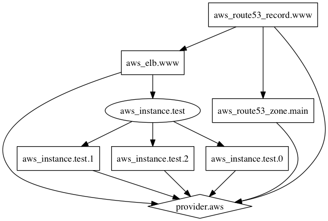

# Command: graph

The `tofu graph` command is used to generate a visual
representation of either a configuration or execution plan.
The output is in the DOT format, which can be used by
[GraphViz](http://www.graphviz.org) to generate charts.

## Usage

Usage: `tofu graph [options]`

Outputs the visual execution graph of OpenTofu resources according to
either the current configuration or an execution plan.

The graph is outputted in DOT format. The typical program that can
read this format is GraphViz, but many web services are also available
to read this format.

The `-type` flag can be used to control the type of graph shown. OpenTofu
creates different graphs for different operations. See the options below
for the list of types supported. The default type is "plan" if a
configuration is given, and "apply" if a plan file is passed as an
argument.

:::note
Use of variables in [module sources](../../language/modules/sources.mdx#support-for-variable-and-local-evaluation),
[backend configuration](../../language/settings/backends/configuration.mdx#variables-and-locals),
or [encryption block](../../language/state/encryption.mdx#configuration)
requires [assigning values to root module variables](../../language/values/variables.mdx#assigning-values-to-root-module-variables)
when running `tofu graph`.
:::

Options:

* `-plan=tfplan`    - Render graph using the specified plan file instead of the
  configuration in the current directory.

* `-draw-cycles`    - Highlight any cycles in the graph with colored edges.
  This helps when diagnosing cycle errors.

* `-type=plan`      - Type of graph to output. Can be: `plan`, `plan-refresh-only`, `plan-destroy`, or `apply`.

* `-module-depth=n` - (deprecated) In prior versions of OpenTofu, specified the
  depth of modules to show in the output.

* `-var 'NAME=VALUE'` - Sets a value for a single
  [input variable](../../language/values/variables.mdx) declared in the
  root module of the configuration. Use this option multiple times to set
  more than one variable. Refer to
  [Input Variables on the Command Line](plan.mdx#input-variables-on-the-command-line) for more information.

* `-var-file=FILENAME` - Sets values for potentially many
  [input variables](../../language/values/variables.mdx) declared in the
  root module of the configuration, using definitions from a
  ["tfvars" file](../../language/values/variables.mdx#variable-definitions-tfvars-files).
  Use this option multiple times to include values from more than one file.

There are several other ways to set values for input variables in the root
module, aside from the `-var` and `-var-file` options. Refer to
[Assigning Values to Root Module Variables](../../language/values/variables.mdx#assigning-values-to-root-module-variables) for more information.

## Generating Images

The output of `tofu graph` is in the DOT format, which can
easily be converted to an image by making use of `dot` provided
by GraphViz:

```shellsession
$ tofu graph | dot -Tsvg > graph.svg
```

Here is an example graph output:

